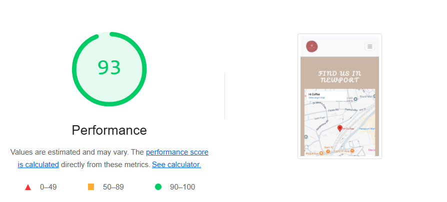
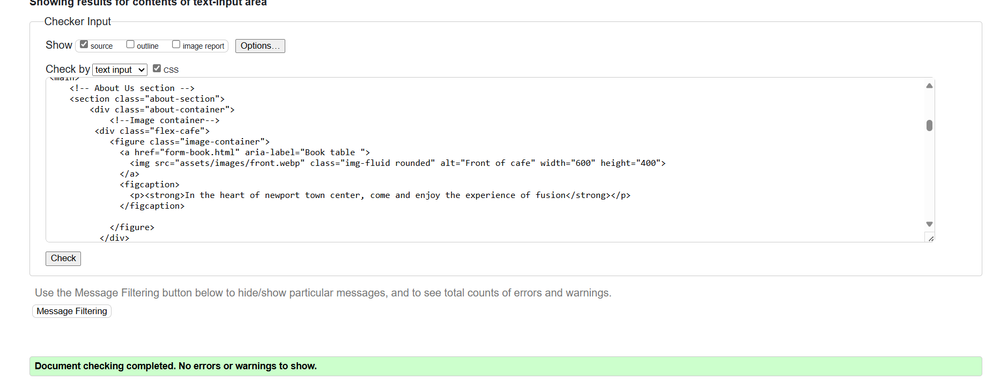
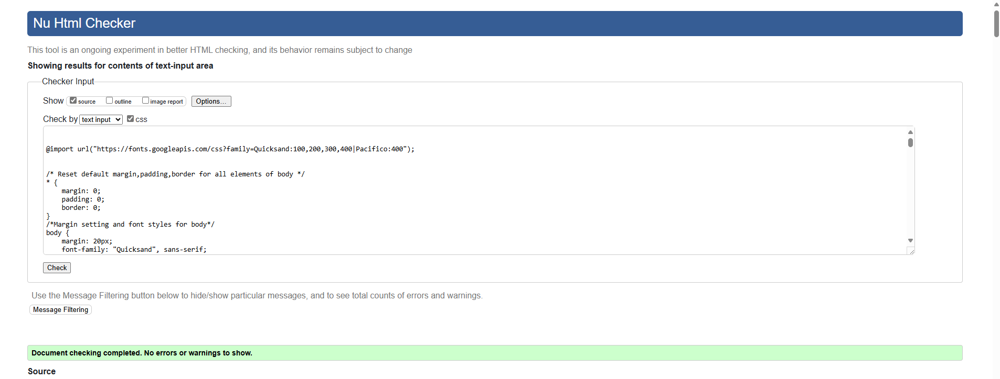

# Chai & Pie 

## Introduction 
The Chai & Pies Café website offers a glimpse into our unique range of fusion treats, from Savory delights like samosas, pasties, and tikka sandwiches to indulgent fusion desserts like chocolate samosas. We also serve a variety of innovative drinks, blending traditional tea and coffee flavors with modern twists. You can conveniently explore our full menu online, place orders, and choose flexible pickup options. Our aim is to create a simple and enjoyable experience for all, making our cross-cultural culinary fusion accessible to everyone.

## Project Goals
The Chai & Pies Café website offers a look into our menu of fusion-inspired dishes, including savory pies, samosas, indulgent desserts, and specialty drinks. Users can easily reserve a table, explore flexible booking options, and reach out with any questions or feedback. The aim is to create a warm, accessible experience that invites everyone to enjoy our unique blend of flavors and cultures.

1.**Explore Fusion Cuisine:** Highlight our unique menu of fusion-inspired dishes, from savory samosas and pies to rich desserts and specialty drinks, inviting guests to savor diverse flavors crafted from a blend of culinary traditions.

2.**Convenient Table Reservations:** Provide a simple booking form so guests can reserve a table with ease, ensuring a comfortable and welcoming experience whenever they visit.

3.**Easy Inquiries & Feedback:** Offer an accessible contact form for guests to ask questions, request special options, or provide feedback, helping us create a personalized experience for our community.

4.**Fusion Food Stories & Insights:** Share articles, recipes, and stories that celebrate the cultural blending behind our cuisine, inspiring guests with the rich heritage of each flavor.

5.**Community Events & Gatherings:** Feature our calendar of events—such as game nights, cultural tastings, and themed gatherings—inviting guests to join us in celebrating food, culture, and community in a vibrant café setting.

## User Stories

### First-Time Visitor Goals:

1.As a first-time visitor, I want to quickly understand the purpose of the Chai & Pies Café website, giving me insight into the cafe’s fusion cuisine and unique offerings.

2.As a first-time visitor, I aim for an easy, intuitive browsing experience that lets me find key information about the cafe, its menu, and services.

3.As a first-time visitor, I look forward to reading testimonials to assess the quality of Chai & Pies’ food and the overall dining experience.
Returning Visitor Goals:

### Returning Visitors Goal 
1.As a returning visitor, I want to explore the full menu of fusion-inspired dishes at Chai & Pies, making it simple to find my preferred items or try something new.
2.As a returning visitor, I seek accessible ways to connect with the cafe, allowing me to ask questions, make specific requests, or give feedback about my experience.
3.As a returning visitor, I aim to learn about upcoming events, like game nights or events at Chai & Pies, to plan a visit around these experiences and enjoy community-focused gatherings.
4.As a returning visitor, I want to explore additional content about fusion cuisine, helping me connect more deeply with the café’s culinary approach and community.

### Frequent Visitor Goals:
1.As a frequent visitor, I want quick access to updates on seasonal menu items or special events, helping me decide which dishes or events to try next.
2.As a frequent visitor, I appreciate flexible contact options, making it easy to communicate in a way that best suits my needs, whether for inquiries or to share feedback.
3.As a frequent visitor, I look forward to discovering new articles, recipes, or cultural stories shared by Chai & Pies, keeping me engaged and informed about the café’s evolving fusion cuisine and community events.

## User Experience (UX) & User Interface (UI)
### Wireframes
Wireframes are made using Balsamiq

-
Wireframes
 

## Design

### Images
The images on the Chai & Pies website are thoughtfully selected to enhance the user experience and align with the site’s overall theme. Featuring warm, earthy tones and scenes that evoke cozy tea times and homemade treats, the visuals create an inviting atmosphere meant to foster feelings of comfort and relaxation. These earthy hues not only add warmth but also harmonize with the primary color palette, reinforcing the brand’s identity.

### Colour Scheme
The colour scheme was generated using Coolors.
The main colors used are Brown and Beige to give a warmth and natural touch to the website. The breakdown of colors is as follows:

## Cabana Tan (#CAB6A5): 
Used as a background color in several elements (e.g., hero sections, category backgrounds, forms, and contact areas) to create a soft, inviting aesthetic.
## Warm Brown (#4A2F1C): 
Featured prominently for text, borders, and icons to provide contrast and warmth. This deep brown adds depth and elegance.

## Sandy Beige (#CEA07E):
Used for elements like cover text backgrounds and section headers, contributing to a natural, subdued tone.

## Orange-Brown (#ca8028):
 Applied to headings, navbar links, and hover states to highlight important sections and draw the eye, creating contrast without overwhelming the palette.

## Dark Brown (#402e32):
 Found in borders, hover states, and background accents to add cohesiveness across elements and a rich, rustic feel.

These colors are supported by white and black for neutral contrast and clarity. The result is a warm, natural, and cohesive color scheme that feels both inviting ,sophisticated and effortlessly unified.

### Fonts
Fonts were imported via [Google Fonts](https://fonts.google.com/). The Fonts used were Pacifico mainly for slogan and h2 headings. The main font was Quick sand and Sans Serif used as backup font, in case for any reason the main font isn't being imported into the site correctly.

### Chai & Pies logo
Our logo captures the essence of Chai & Pies, blending warmth and a touch of elegance. The steaming cup of tea symbolizes comfort and relaxation, while the gentle earthy tones convey a cozy, inviting ambiance. The tagline, 'Crunch with every sip,' hints at a delightful pairing of flavors that makes each visit a memorable experience.

## Features
- ### Navigation 
The navigation is designed to offer users a smooth and visually engaging experienec.The summary of its key navigation elements as follows:

#### Navbar
##### Desktop View:

The Navbar is loacted at the top of page and comprises of Logo and navigation link.
 ##### Logo: 
 The cafe logo is diplayed on the left side.Clicking on the logo takes you to Home page no matter what page you are on and if you are already on Home page it refreshes the page.
 Navigation Link: On the right side there are links to different pages of the websites which are as follows:
 - **Home:** Leads to main page that gives an overview to the users of what they can expect to see in next few pages.Its mainly who we are.
 - **About Us:** Give users an inbdepth of why are who we are. Takes users on a journer of why we started it and what services we offer and what to expect once you visit our cafe.
 - **Menu:** Takes user on a journey to choose from savouries and sweets we offer along with the experience in cafe.
 - **Contact:** Gives user a location and details where to find us and contact us via phone, email or query form if they have any questions
 - **Book A Table:** A booking form if they are looking to book a event ot just a table to have a chat and chai with friends or even if just a quiet corner with a good book to read.    

 
**Mobile View:**

- On mobile devices, the navigation bar features the logo and hamburger menu.
- Logo remains on the left and menu  bar on right providing aesthetically pleasing appearance.

### Footer
Connect with us on social media and stay updated on our latest events and offerings:

- **Instagram**: [Follow us in ](https://instagram.com/)
- **Facebook**: [Like our page](https://facebook.com/)
- **Twitter**: [Tweet with us](https://twitter.com/)
-**Copyright**: 2024[chai&pies](http://www.linkedin.com/in/
aisha-shah-b1921229)

 
  ### The Landing Page Image(Home)
   The landing page features an inviting image showcasing cafes interior with books on oneside and the counter on the other with a text overlay that highlights the purpose of Chai & Pies.
   This section gives users a clear visual introduction to the site’s mission and vibe.

  ### Home page 
  
  The homepage offers visitors an insight into the cafe's core mission and vision. The hero image features the cover text, "Food that brings people closer," emphasizing that the cafe's purpose extends beyond serving delicious meals; it aims to bridge cultural gaps and unite diverse individuals under one roof.

  **Offers**
 The homepage following the hero image highlights current promotions at the café, designed to instill a sense of urgency for customers to take advantage of these offers.
 

  **Chai iamge and content**
  
The "Chai and Sigh" section provides users with an overview of what to expect, highlighting that they can customize their drinks to suit their personal preferences and needs. It also emphasizes that, in addition to offering a unique fusion experience, the cafe provides authentic flavors in both coffee and chai.
 

**Snack, pies and delights Section**
The "Snacks, Pies, and Delights" section offers users a comprehensive look at the delectable snacks and pies available at the cafe. It showcases the wide variety of options, inviting guests to explore an assortment of flavors and textures that cater to diverse tastes. The section embodies the slogan "Sip with Every Crunch," emphasizing the delightful pairing of crispy, savory treats with a refreshing drink. This fusion of flavors enhances the overall dining experience, making each bite a perfect complement to the cafe's signature beverages.

###About Us page 
The about us page is divided into 3 parts 
**Front Image**
The about us page starts with the front of the cafe and little overview of why we are what we claim to be. The image of front of the cafe depicts the ambiance and services provide as it aligns with overall theme and vision of the cafe.
[front](Documentation/websiteimages/front.png)
**Services**
The services are divided into four categories, each with its own unique specifications and images that showcase the events and services available to users.

Chai and Chat: This category celebrates the cherished moments shared with family and friends over a cup of chai, appealing to those who love to enjoy conversations while sipping tea.

Quiet Corner: This section is designed for users seeking a respite from their usual surroundings. It offers a peaceful space to enjoy a cup of tea while getting lost in a good book, allowing them to be surrounded by others who are also immersed in their own thoughts.

-Events: This section is for users who enjoy a nice karaoke, game night or just a little poetry night or may be a tasting event.It gives users an overview what events are organised at chai and pies.

-Parties: Users looking to books space for arranging parties, be it a corporate party or kids birthday party.

All categories have a footer with book a table link for users to navigate easily to booking a table form.

**Event schedule**

This section focuses on upcoming events, presented in a table format for user convenience. It includes details such as prices and times, showcasing when each event is scheduled to occur.
users can book from here as per convenienve using the book now button.

### Menu Page
The menu page is thoughtfully organized into four main sections to enhance user experience and simplify navigation, allowing customers to quickly find the type of food or drink they’re interested in when visiting the cafe. These sections—**Drinks**, **Snacks**, **Pies**, and **Desserts**—each feature a diverse array of options, showcasing our creative fusion of flavors from different culinary traditions.

- **Drinks**: This section offers an enticing selection of beverages, from traditional chai and coffee options to innovative fusion drinks that blend exotic spices and flavors. Whether customers are in the mood for a soothing chai, a bold coffee, or a refreshing seasonal drink, the variety ensures there’s something for every palate.

- **Snacks**: In the Snacks section, users can explore a mix of savory and crispy delights, including fusion-inspired takes on classic snacks. From samosas with a twist to gourmet sandwiches, each item is crafted to complement our signature drinks, creating a perfect balance between flavor and texture.

- **Pies**: The Pies section is dedicated to our freshly baked offerings, which combine classic and contemporary flavors. Here, customers can find both sweet and savory pies that showcase a unique blend of ingredients, offering a new take on traditional pies while honoring familiar tastes.

- **Desserts**: For those with a sweet tooth, the Desserts section features a range of decadent treats, from fusion-inspired sweets to timeless classics. Each dessert is designed to provide a satisfying finish to the dining experience, blending flavors that are both indulgent and comforting.

Each section reflects our commitment to innovation and quality, bringing together ingredients and techniques from various culinary backgrounds to create a distinctive menu. The layout of the menu page makes it easy for users to explore these diverse offerings, allowing them to appreciate the thoughtful fusion of recipes that defines the Chai & Pies experience.

### Contact
The contact page guides users to a map showing the café’s location and provides contact details, including email, phone number, and address. It also features a form where users can submit questions or share feedback. Built using the Bootstrap framework, the form is complemented by a background video, adding an aesthetically pleasing touch to the page.

### Booking Page
A separate booking page was created specifically for users looking to reserve an event, table, or party. Designed independently from the contact form, it allows users to navigate and make bookings with ease. The form's layout draws inspiration from board game walkthroughs, enhancing its user-friendly design. The form contains section for name, email adress, phone number and type of event user would like to book.

### Success Page 

Th esuccess page appears after the user has submitted the contact form correctly.
It starts with thanking user for choosing Chai and pies and then goes on to reassuring the users that they will be contacted with confirmation.

### 404 page
A 404 page was also created in case , users cannot reach the page at that moment of type whether its a typo or any other technical issue. Th e404 page provides user with a picture of cartoon holding chai and pies with a light hearted caption directing them to return to homepage.

## Technologies Used
### Frameworks - Libraries - Programs Used
- [Am I Responsive](http://ami.responsivedesign.is/) - Used to verify responsiveness of website on different devices.
- [Responsinator](http://www.responsinator.com/) - Used to verify responsiveness of website on different devices.
- [Balsamiq](https://balsamiq.com/) - Used to generate Wireframe images.
- [Chrome Dev Tools](https://developer.chrome.com/docs/devtools/) - Used for overall development and tweaking, including testing responsiveness and performance.
- [Shuttershock](http://shuttershock.com/) - Used for images and videos.
- [Font Awesome](https://fontawesome.com/) - Used for Social Media icons in footer and contact icons on contact forms.
- [GitHub](https://github.com/) - Used for version control and hosting.
- [Google Fonts](https://fonts.google.com/) - Used to import and alter fonts on the page.
- [TinyPNG](https://tinypng.com/) - Used to compress images to reduce file size without a reduction in quality.
- [W3C](https://www.w3.org/) - Used for HTML & CSS Validation.

## Testing
### Lighthouse report
Using lighthouse in devtools and speed insight I can confirm now that the website is perfoming well with 100 on SEO , more than 90 on accessibility and colours and fonts chosen.
**Home page**

Desktop:

Mobile:

**About us page**

Desktop:

Mobile:

**Menu**

Desktop:

Mobile:

**Contact page**

Desktop:

Mobile:

**BookATable page**

Desktop:

Mobile:

## Responsiveness
### Device Testing
- The website was viewed on a variety of devices such as Desktop, Laptop, iPhone 8, iPhoneX and iPad to ensure responsiveness on various screen sizes. The website performed as intended. The responsive design was also checked using Chrome developer tools across multiple devices with structural integrity holding for the various sizes.
- I also used the following websites to test responsiveness:
    - [Responsinator](http://www.responsinator.com/?url=https%3A%2F%2Fwebwiz-perer.github.io%2FChai-Pies.com)
    - [Am I Responsive](https://ui.dev/amiresponsive?url=https://webwiz-perer.github.io/Chai-Pies.com)

## w3c Validator
#### HTML
No error were found on any page when running through offcial W3C Markup Validator

## Manual Testing

## Deployment

The project was deployed using GitHub pages. The steps to deploy using GitHub pages are:

1. Go to the repository on GitHub.com
2. Select 'Settings' near the top of the page.
3. Select 'Pages' from the menu bar on the left of the page.
4. Under 'Source' select the 'Branch' dropdown menu and select the main branch.
5. Once selected, click the 'Save'.
6. Deployment should be confirmed by a message on a green background saying "Your site is published at" followed by the web address.

The live link can be found here - [Chai & Pies](https://webwiz-perer.github.io/Chai-Pies.com/)

## Bugs Found and solved
-When I first implemented my navigation bar, I was having lots of space on the left side and all the items of navigation bar were centered. I tried reducing the padding but nothing helped and after little resecrh into bootstrap and css, apllied flex to display and it was sorted.
- When adding images, I was using absolute rather than relative path and was not able to see the error until I deployed my website. The error was not visible in preview as the pictures were loading. After going forth and back found out that it was due to absolute path being used.
- I applied the images initially to the size that I downloaded. 
- There were other minor hiccups in css but was sorted by adding media queries.
## Unsolved Bugs

## Mistakes

## Future features to be added
## Credits

### Contents
The inspiration was taken from cafe websites and content was researched through google and chat gpt was used to rephrase own words in more user friendly and professional manner.
[Bella Cafe](https://belacafe.co.uk/)
[Brunch Club](https://www.the-brunch-club.co.uk/)
[Chatgpt](https://chatgpt.com/)

### Media
All the media images and video were generated from AI using shuttershock.I own the license for both the videos and all the images.
[Shuttershock](www.shuttershock.com)

## Acknowledgements
My mentor Antonio for his support and advice.

The course facilitator Marco for his continous support and constructive feedback.

The tutors for helping whenever there is a brain fog.

The Code Institute slack community for their quick responses and wealth of knowledge